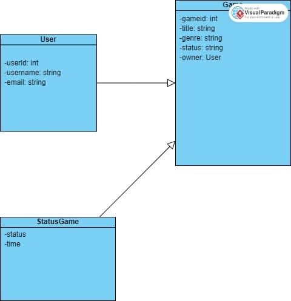
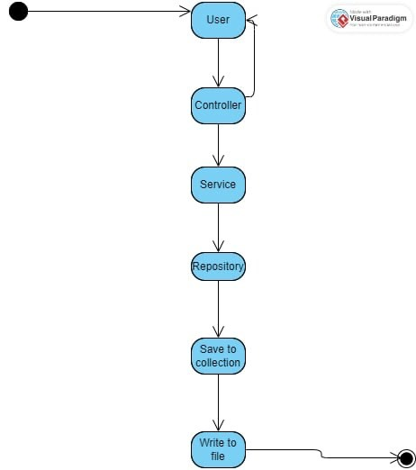
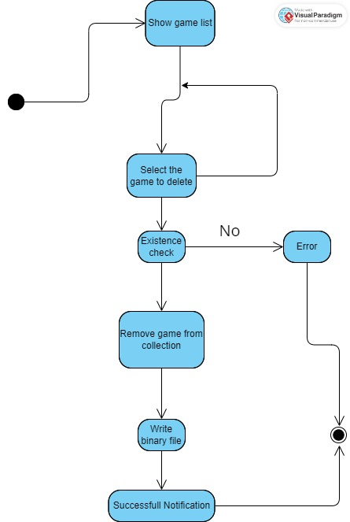
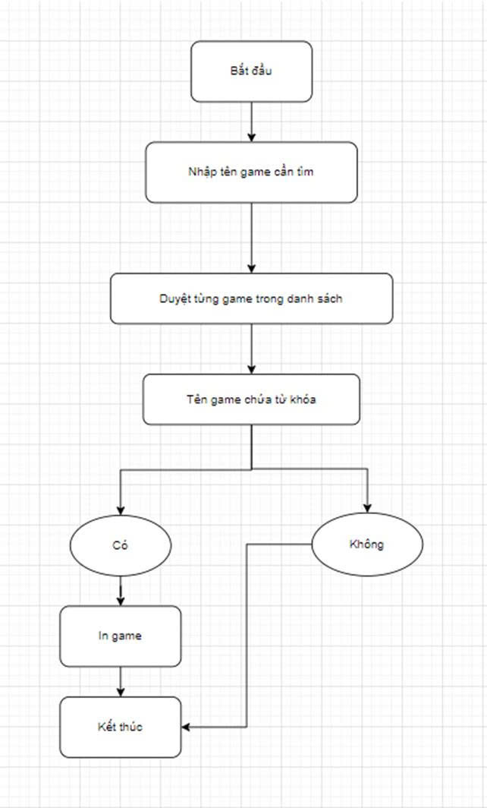

# Group 6 Project: Xây dựng ứng dụng quản lý game cá nhân.
# Giới thiệu:
Ứng dụng quản lý game cá nhân là một ứng dụng desktop được phát triển bằng ngôn ngữ Java, nhằm giúp người dùng quản lý bộ sưu tập game cá nhân một cách dễ dàng, trực quan và có hệ thống. Thay vì phải ghi nhớ hoặc lưu trữ thủ công thông tin các tựa game, ứng dụng này cung cấp một giao diện thân thiện để lưu trữ và tra cứu các tựa game mà người dùng đã sở hữu.
# Tính năng:
1. Thêm game mới vào thư viện.

2. Xem danh sách game .

3. Tìm kiếm game theo tên hoặc nền tảng.

4. Lọc game theo thể loại hoặc trạng thái.

5. Sửa thông tin game (ví dụ: muốn cập nhật trạng thái từ "Đang chơi" sang "Hoàn thành").

6. Xóa game không còn trong thư viện.

# Công nghệ sử dụng:
Ngôn ngữ lập trình: Java

Giao diện người dùng (UI):JavaFX

Lưu trữ dữ liệu: MySQL
# Giao diện:
Một bảng hiển thị danh sách các tựa game (tên, nền tảng, thể loại, trạng thái).

Thanh tìm kiếm nằm ở trên

Các nút trong ứng dụng: “Thêm game”, “Sửa”, “Xóa”, “Thống kê”, “Lọc”.

Form nhập liệu khi bấm "Thêm game"

# Thành viên:
1. Hoàng Việt Anh
2. Nguyễn Quốc Quang Anh
3. Nguyễn Thế Cường
4. Nguyễn Lệ Thu

# diagram
1. activity

2. control

3.deleteGame

4. Lưu đồ thuật toán

